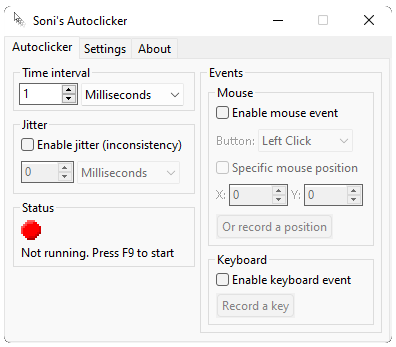

# Soni's Autoclicker

The (soon to be) most advanced autoclicker on the planet - Soni's Autoclicker aims to make automation powerful and
accessible to everyone.

Have you ever been in a situation where you needed to click fast, or click a lot at a given interval? Maybe you had to
press your keyboard too? This has got you covered. The autoclicker is powerful and easily accessible. Featuring native
builds for all major operating systems, the installation process is just a simple 'drag-n-drop'. To check it out for
yourself, head over to the [installation instructions](INSTALL.md). You can also [build the project yourself](BUILD.md).

## Features

Soni's Autoclicker is very powerful and has a rich feature set while still being lightweight and cross-platform. The
autoclicker supports:

- Widely customisable time interval
  - Soni's Autoclicker has a very customisable time interval that can range from several days down to only a few 
  nanoseconds. It is the only autoclicker that supports time intervals as precise and fast as this. Although possible,
  it is not recommended setting the time interval very low, as this may cause system instability.
- Jitter / timing inconsistency
  - Soni's Autoclicker supports [jitter](https://en.wikipedia.org/wiki/Jitter). This means that you can set the
  autoclicker to deviate from the set interval. This is good if you want a more random clicking pattern, as it makes the
  time interval not always be the same. It can also be good for seeming more 'natural', and can therefore bypass several
  bot/autoclicker protections that may be in place where you want to use the autoclicker.
- Both mouse and keyboard actions
  - The autoclicker can not only do mouse events, but also keyboard events. If you want to press a key at a set interval
  (or a random interval, using jitter!), this is the perfect tool for you.
- Lightweight and cross-platform
  - Soni's Autoclicker is very lightweight, using very minimal system resources. It has been made with the mindset of
  maximising performance, so you can use it even if your computer is not the best. In addition, it has native
  cross-platform executables. This means that it works 'out of the box' on every major desktop platform currently on the
  market.
- Open source
  - The project is open source, meaning that you can be sure that it is completely free of malware and that the
  [security](SECURITY.md) is on point. It also means that anyone can contribute to the project if they'd like to. This
  makes development faster and easier, and gives everyone the ability to have their own features implemented into the
  project. See anything you would like changed? Have a feature suggestion? Create an
  [issue](https://github.com/soni801/autoclicker/issues/new/choose), and I'd be sure to look at it!  Want to try
  changing something yourself? I am open to PRs. Be sure to read
  [the contributing guidelines](https://github.com/soni801/autoclicker/blob/main/CONTRIBUTING.md) before contributing.

---

[Credits](CREDITS.md)

[Acknowledgements](ACKNOWLEDGEMENTS.md)
